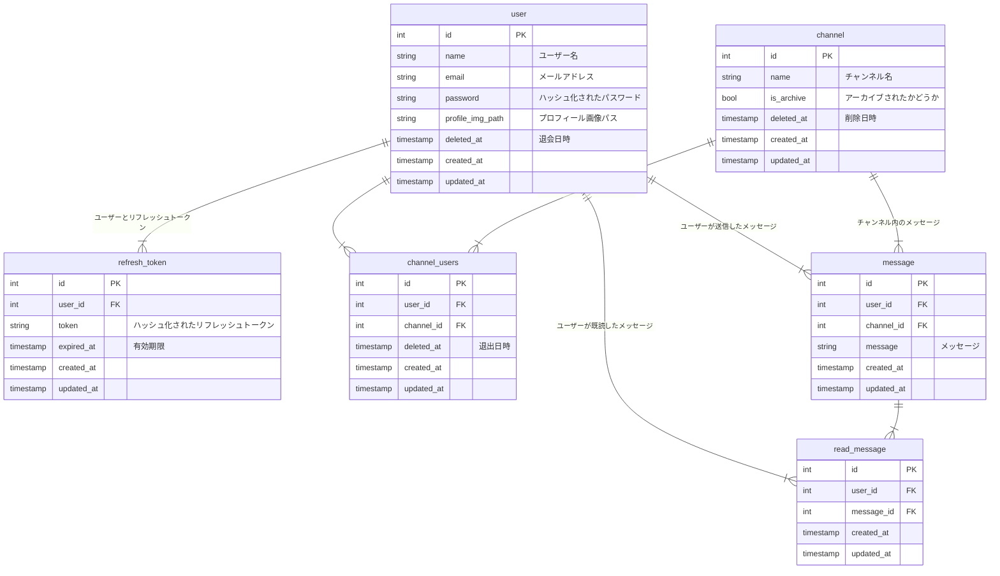

```mermaid
erDiagram
  user ||--|{ refresh_token : "ユーザーとリフレッシュトークン"
  user ||--|{ channel_users : ""
  user ||--|{ message : "ユーザーが送信したメッセージ"
  user ||--|{ read_message : "ユーザーが既読したメッセージ"
  channel ||--|{ channel_users : "チャンネルに参加しているユーザー"
  channel ||--|{ message : "チャンネル内のメッセージ"
  message ||--|{ read_message : ""

  user {
    int id PK
    string name "ユーザー名"
    string email "メールアドレス"
    string password "ハッシュ化されたパスワード"
    string profile_img_path "プロフィール画像パス"
    timestamp deleted_at "退会日時"
    timestamp created_at
    timestamp updated_at
  }

  refresh_token {
    int id PK
    int user_id FK
    string token "ハッシュ化されたリフレッシュトークン"
    timestamp expired_at "有効期限"
    timestamp created_at
    timestamp updated_at
  }

  channel {
    int id PK
    string name "チャンネル名"
    bool is_archive "アーカイブされたかどうか"
    timestamp deleted_at "削除日時"
    timestamp created_at
    timestamp updated_at
  }

  channel_users {
    int id PK
    int user_id FK
    int channel_id FK
    timestamp deleted_at "退出日時"
    timestamp created_at
    timestamp updated_at
  }

  message {
    int id PK
    int user_id FK
    int channel_id FK
    string message "メッセージ"
    timestamp created_at
    timestamp updated_at
  }

  read_message {
    int id PK
    int user_id FK
    int message_id FK
    timestamp created_at
    timestamp updated_at
  }
```
